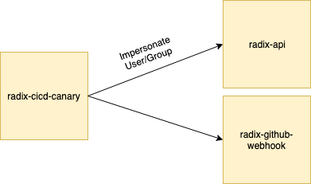

# radix-cicd-canary



The radix-cicd-canary project is meant to be an automated end-to-end test tool to be run continuously in the cluster to verify that the most important functionality is behaving as expected. Is is not deployed as a standard Radix application, but rather as a custom deployment through the Helm chart. The reason for having to deploy it in this way is that it requires custom setup not provided by the platform.

It is currently implemented in Go, providing metrics to external monitoring solution via Prometheus. It relies on being able to impersonate users and will use a set of test users and group defined in the chart for testing.

Currently, there is one scenario (or suite) implemented called `happypath`, with several tests listed as follows.

1. List applications
2. Register application
3. Register application with no deploy key
4. Build application
5. Set secret
6. Check alias responding
7. Check access to application user should not be able to access
8. Delete applications

## How-to deploy

### Deploy from local machine

The tests are deployed to cluster through a helm chart, but first build the docker file (default it will push to radixdev. With ENVIRONMENT=prod it will push to radixprod):

```
make deploy-via-helm ENVIRONMENT=dev|prod CLUSTER_FQDN=<clustername>.<clustertype>.radix.equinor.com

Example: 
make deploy-via-helm ENVIRONMENT=dev CLUSTER_FQDN=weekly-27.dev.radix.equinor.com
```

### Deploy via radix-platform

The tests are included in the `install_base_components.sh` script that is typically run when a new cluster is created. Before running the script, make sure that the docker file has been built and pushed to ACR:

```
make build-push ENVIRONMENT=dev|prod
```

And make sure that the helm chart is pushed to ACR:

```
cd charts/radix-cicd-canary
helm package .
az acr helm push --name radixdev <tgz file>
az acr helm push --name radixprod <tgz file>
```

## How-to debug

The tests can be run locally for debugging purpose, but it will still run against an existing cluster. A config map named `radix-cicd-canary` should be created in the cluster. The format of the config map can be found at `charts/templates/config.yaml`.

### Entire application

The tests can be debugged in its entirety by setting `BEARER_TOKEN` value in `launch.json` file, then run debug from VSCode (F5).

### Unit tests

The tests can be debugged per unit test by setting `BEARER_TOKEN` value in `env_utils.go` file, then run debug on each unit test.